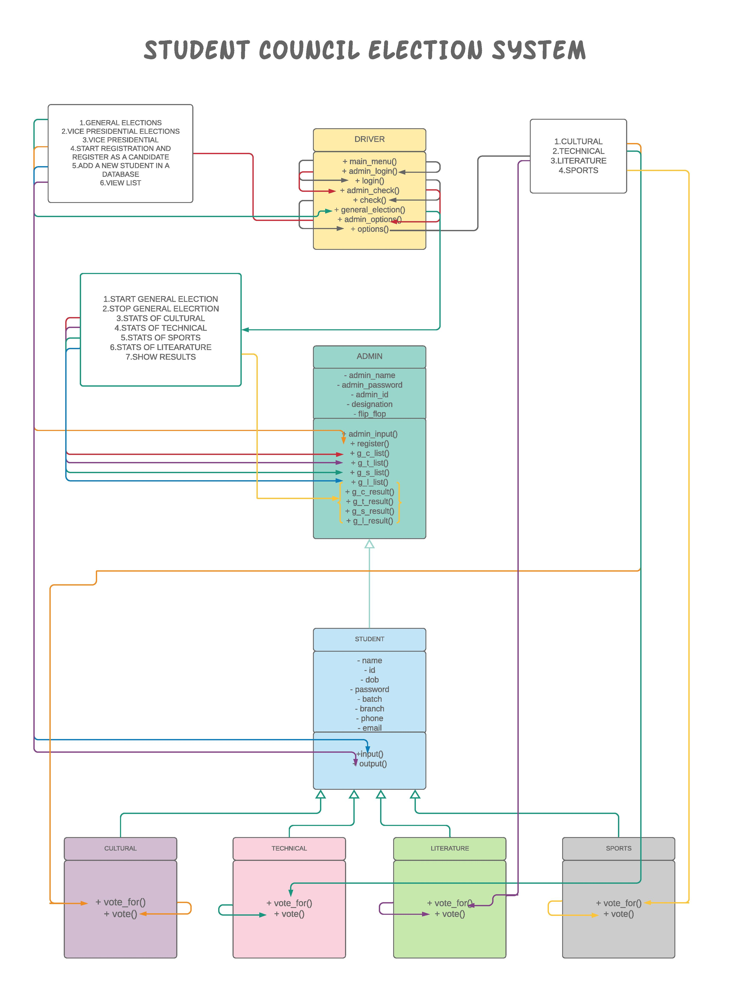

# Student Council Election System

## Introduction
A java program which could help to conduct student general body elections of various committees in a college. For any college, the major committees include **Sports**, **Cultural**, **Literature** and **Technical**. 

## Work Flow
For the general elections, the admin has the responsibility to start, stop or view the current statistics of the election. Students could stand in the general election of any committee after being reviewed by the admin. Students can give their vote to at most one candidate of every committe.

After completion of general elections, top 12 Candidates from every committes are selected. Then These selected candidates are responsible for voting of President and vice-President of their respective committees.

## Pre-requirements
After cloning or downloading this repository, the files in the requirements need to created at any desired location on you pc and the path must be updated in the corresponding (.java) files. 

## UML Diagram

